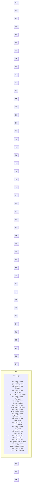

```mermaid
flowchart LR
    classDef pass stroke:#66bb6a
    classDef warn stroke:#ffa726
    classDef fail stroke:#f44336
    subgraph AK["`AK`"]
        direction LR
    end
    subgraph AL["`AL`"]
        direction LR
    end
    subgraph AR["`AR`"]
        direction LR
    end
    subgraph AZ["`AZ`"]
        direction LR
        n1["`data.csv.gz<br/><br/><ul><li><code>missing_info: geography_name</code></li><li><code>missing_info: N_dtap</code></li><li><code>missing_info: N_polio</code></li><li><code>missing_info: N_mmr</code></li><li><code>missing_info: N_hep_b</code></li><li><code>missing_info: N_varicella</code></li><li><code>missing_info: N_personal_exempt</code></li><li><code>missing_info: N_medical_exempt</code></li><li><code>missing_info: N_full_exempt</code></li><li><code>missing_info: pct_dtap</code></li><li><code>missing_info: pct_polio</code></li><li><code>missing_info: pct_mmr</code></li><li><code>missing_info: pct_hep_b</code></li><li><code>missing_info: pct_varicella</code></li><li><code>missing_info: pct_personal_exempt</code></li><li><code>missing_info: pct_medical_exempt</code></li><li><code>missing_info: pct_full_exempt</code></li></ul>`"]:::warn
    end
    subgraph CA["`CA`"]
        direction LR
    end
    subgraph CO["`CO`"]
        direction LR
    end
    subgraph CT["`CT`"]
        direction LR
    end
    subgraph DE["`DE`"]
        direction LR
    end
    subgraph FL["`FL`"]
        direction LR
    end
    subgraph GA["`GA`"]
        direction LR
    end
    subgraph HI["`HI`"]
        direction LR
    end
    subgraph IA["`IA`"]
        direction LR
    end
    subgraph ID["`ID`"]
        direction LR
    end
    subgraph IL["`IL`"]
        direction LR
    end
    subgraph IN["`IN`"]
        direction LR
    end
    subgraph KS["`KS`"]
        direction LR
    end
    subgraph KY["`KY`"]
        direction LR
    end
    subgraph LA["`LA`"]
        direction LR
    end
    subgraph MA["`MA`"]
        direction LR
    end
    subgraph MD["`MD`"]
        direction LR
    end
    subgraph ME["`ME`"]
        direction LR
    end
    subgraph MI["`MI`"]
        direction LR
    end
    subgraph MN["`MN`"]
        direction LR
    end
    subgraph MO["`MO`"]
        direction LR
    end
    subgraph MS["`MS`"]
        direction LR
    end
    subgraph MT["`MT`"]
        direction LR
    end
    subgraph NC["`NC`"]
        direction LR
    end
    subgraph ND["`ND`"]
        direction LR
    end
    subgraph NE["`NE`"]
        direction LR
    end
    subgraph NH["`NH`"]
        direction LR
    end
    subgraph NJ["`NJ`"]
        direction LR
    end
    subgraph NM["`NM`"]
        direction LR
    end
    subgraph NV["`NV`"]
        direction LR
    end
    subgraph NY["`NY`"]
        direction LR
    end
    subgraph OH["`OH`"]
        direction LR
    end
    subgraph OK["`OK`"]
        direction LR
    end
    subgraph OR["`OR`"]
        direction LR
    end
    subgraph PA["`PA`"]
        direction LR
    end
    subgraph RI["`RI`"]
        direction LR
    end
    subgraph SC["`SC`"]
        direction LR
    end
    subgraph SD["`SD`"]
        direction LR
    end
    subgraph TN["`TN`"]
        direction LR
    end
    subgraph TX["`TX`"]
        direction LR
    end
    subgraph UT["`UT`"]
        direction LR
    end
    subgraph VA["`VA`"]
        direction LR
    end
    subgraph VT["`VT`"]
        direction LR
    end
    subgraph WA["`WA`"]
        direction LR
    end
    subgraph WI["`WI`"]
        direction LR
    end
    subgraph WV["`WV`"]
        direction LR
    end
    subgraph WY["`WY`"]
        direction LR
    end
```
